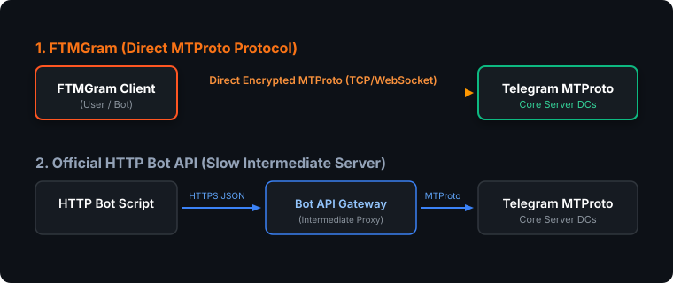

MTProto vs Bot API
==================

MTProto is Telegram's native binary protocol used by official apps and FTMGram to communicate
directly with Telegram core servers with maximum speed, zero intermediate proxies, and full feature access.

Key Differences
---------------

1. **Direct Connection**: FTMGram connects directly to Telegram MTProto datacenters via TCP / WebSocket.
2. **Speed & Latency**: MTProto avoids the intermediate Bot API HTTP proxy layer.
3. **Full MTProto Layer Access**: Call raw MTProto functions and access features before they arrive on HTTP Bot API.
